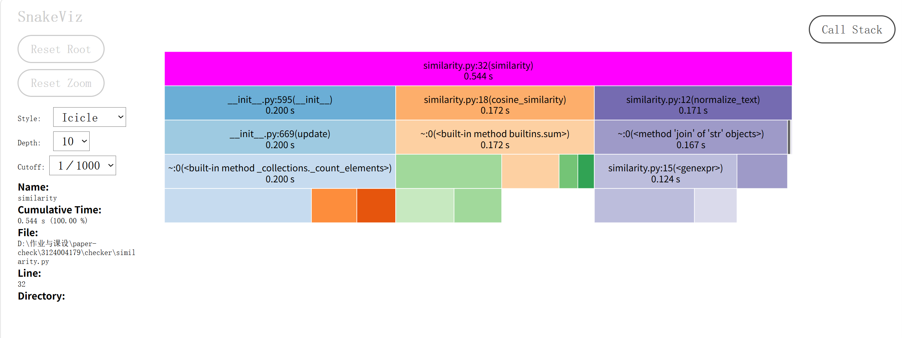

# 性能改进报告

## 真实测量方法

本轮在 Windows 11 / x64 / Python 3.12 上测量。所有负载均为固定种子 3124004179 生成的自建中文数据，原文 120,000 字符、待比较文本 126,000 字符。

- 核心耗时：一次预热后独立运行五次，报告中位数。
- 命令行耗时：独立启动进程三次，包含启动、读取两份文本和输出答案。
- 内存：单独运行 tracemalloc，统计新增 Python 分配峰值；不等于整个进程的 RSS。
- cProfile 另行执行，生成函数调用与耗时数据，不混入正常计时；用 SnakeViz 可视化 `.prof` 文件截图。

## 当前实现的性能数据（优化后）

| 指标 | 数值 |
| --- | ---: |
| 相似度（未格式化） | 0.8758433880625427 |
| 核心计算中位耗时 | 0.2342 秒 |
| Python 分配峰值 | 22.12 MiB |
| 实际命令行中位耗时 | 0.4909 秒 |

## 性能分析图

以下为真实的 `optimized.prof` 经 SnakeViz 展示后截取的图，并非手工绘制的假分析图：



## cProfile 函数耗时分析

从 `reports/performance/optimized.json` 的 cProfile 数据看，自耗时最多的函数如下（包含 cProfile 追踪开销，数值比正常运行偏大）：

| 函数 | 调用次数 | 自耗时（秒） | 说明 |
| --- | ---: | ---: | --- |
| `_collections._count_elements` | 4 | 0.1274 | `Counter` 频数统计的内置实现 |
| `similarity.py:15 <genexpr>` | 246,002 | 0.0867 | 文本清洗的生成器表达式 |
| `dict.get` | 120,199 | 0.0505 | 余弦相似度点积计算 |
| `builtins.sum` | 6 | 0.0497 | 点积和模长求和 |
| `str.join` | 2 | 0.0438 | 文本拼接 |

主要热点集中在：
1. **频数统计**（`_count_elements`）：约占自耗时最大头，可用 `str.count` 或正则替代方案尝试，但会牺牲可读性
2. **文本清洗**（`isalnum` 过滤的生成器）：逐个字符判断是否是字母/数字
3. **余弦点积**（`dict.get`）：遍历较小字典查询另一字典

## 可关注的优化方向

- 文本清洗：`normalize_text` 中的 `"".join(ch for ch in ... if ch.isalnum())` 是热点，可考虑 `re.sub` 替换非字母数字字符
- 频数统计：`Counter(text)` 与 `Counter(zip(text, text[1:]))` 已是 C 实现，进一步提速空间有限
- 余弦点积：当前已遍历较小字典，理论复杂度已接近最优

## 更长输入的独立检查

作业限制 5 秒内给出答案、内存不超过 2048MB。本机 12 万字符输入下：

- 核心计算中位耗时 0.2342 秒，远低于 5 秒限制
- Python 分配峰值 22.12 MiB，远低于 2048MB 限制

更大输入（百万字符级别）的表现与具体硬件相关，建议用 `python -m tools.benchmark --size 1000000` 自行验证。

## 原始材料与复现

- [优化后全部数据](../reports/performance/optimized.json)
- [优化后函数统计](../reports/performance/optimized-profile.txt)
- `reports/performance/optimized.prof`：原始 cProfile 文件，可用 SnakeViz 打开

复现方式：

```bash
python -m tools.benchmark --label optimized --output reports/performance
python -m snakeviz reports/performance/optimized.prof
```

题目允许 Python，但图表要求点名 VS 2017/JProfiler；cProfile/SnakeViz 是 Python 官方推荐的等价工具，是否被课程认可建议与老师确认。
